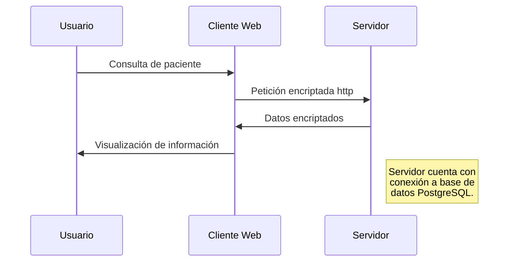

# HISTORIA CLINICA DIGITALIZADA

El presente proyecto, corresponde al desarrollo del _prototipo de historia clinica digitalizada para IPS Colombianas_, bajo el estándar [FHIR](https://hl7.org/FHIR/).

Dicho estándar, corresponde a un estándar global conocido como el [HL7](http://www.hl7.org/index.cfm), el cuál es un conjunto de estándares para facilitar el intercambio electrónico de inormación clinica; que utiliza una notación de lenguaje unificado de modelado [UML](https://es.wikipedia.org/wiki/Lenguaje_unificado_de_modelado).

## Fast Healthcare Interoperability Resources (FHIR)

Fast Healthcare Interoperability Resources (FHIR, pronunciado "fuego" en inglés) es un _estándar_ que describe los formatos y elementos de datos (conocidos como _"recursos"_) y una interfaz de programación de aplicaciones _(API)_ para intercambiar registros de salud electrónicos _(RSE)_.

_FHIR_ se basa en estándares de formato de datos anteriores de HL7, como _HL7_ versión _2.xy_ y _HL7_ versión _3.x_. Pero es más fácil de implementar porque utiliza un conjunto moderno de tecnología _API_ basada en la web, que incluye un protocolo _*RESTful*_ basado en HTTP , HTML y hojas de estilo en cascada para la integración de la interfaz de usuario, una opción de _*JSON, XML o RDF*_ para la representación de datos.

### Objetivos de FHIR

- Facilitar la interoperación entre los sistemas de atención médica heredados,
- Facilitar el suministro de información de atención médica a proveedores de atención médica e individuos en una amplia variedad de dispositivos.
- Permitir la aplicación de terceros desarrolladores para proporcionar aplicaciones médicas que puedan integrarse fácilmente en los sistemas existentes.

### Flujo de datos

Para realizar la visualización del flujo, descargar la extensión _*[GitHub + Mermaid](https://chrome.google.com/webstore/detail/github-%20-mermaid/goiiopgdnkogdbjmncgedmgpoajilohe)*_

